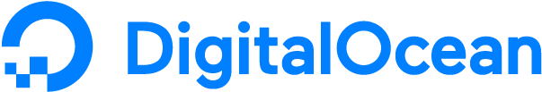
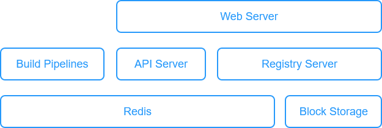

# DigitalOcean Sponsorship & Our Server Infrastructure

<BlogPostMeta />

I am delighted to announce a new ‘Service Sponsorship’ between OpenUPM and DigitalOcean.

Those wonderful people over at DO have agreed to sponsor OpenUPM. They’re providing us a very generous amount of credit which we will use to host this site and other infrastructure. If you’d like to sign up for their services you can using the following [referral link](https://m.do.co/c/50e7f9860fa9), and the new register will get decent onboarding rewards to try DO services. If you haven’t used their infrastructure before, give it a whirl. We were using it anyway even before this sponsorship.

DigitalOcean has proven especially popular with companies developing network-intensive apps, such as video and audio streaming, gaming, real-time communication, IoT, and web crawling. Bandwidth can take up a large part of the cloud bill, and DO charges much less than the average cloud provider. It’s a strong selling point.

Without a deep pocket, OpenUPM uses a simple infrastructure based on our tight budget supported by service sponsorship like DO, [other individual donators](/contributors/), and of course myself:

OpenUPM server infrastructure v1.0

*   Every piece of the graph gets its own server hosted by DigitalOcean.
*   Build pipelines query the GitHub API regularly to process new releases.
*   API server provides extra information for the website.
*   Registry server serves the Unity Pacman.

I admit that even this simple setup has a lot of small pieces talking to each other, especially once GitHub Actions, Netlify CDN, and Azure pipelines are part of the graph. When OpenUPM has more budget, we will upgrade the infrastructure.

Anyway, massive thanks to DigitalOcean for their generous sponsorship of this site and supporting open source!

<BlogPostNav />
