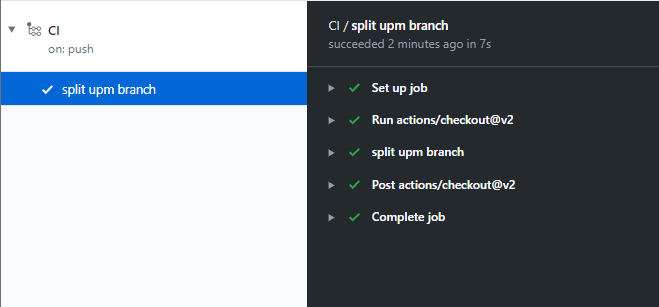
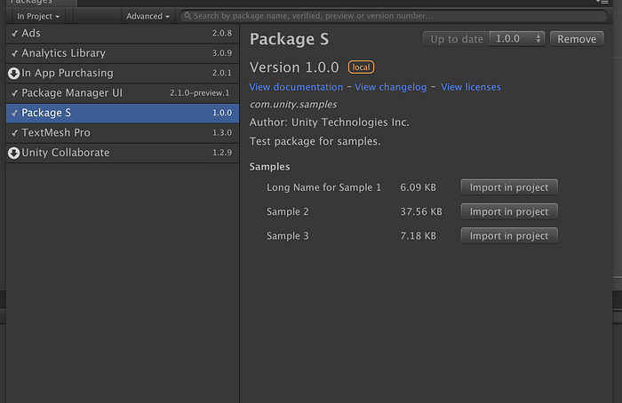
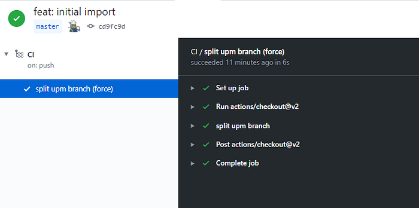
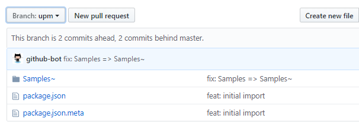

# How to Maintain UPM Package Part 1

<BlogPostMeta />

This is the first post of a series of articles about best practices of managing a UPM repository on GitHub. See [part 2](/blog/how-to-maintain-upm-package-part-2-f352fbf5f87c/), [part 3](/blog/how-to-maintain-upm-package-part-3-2d08294269ad/), and [part 4](/blog/how-to-maintain-upm-package-part-4-managing-package-release-with-cli-972ff5311163/).

To create a UPM repository, the first question is how to organize the directory structure. There’re two popular choices:

*   UPM package at the root path
*   Unity project at the root path, with UPM package at a sub-folder

## UPM package at the root path

The UPM _package.json_ file is located at the root path of the master branch. Since Unity 2019.3 the package manager offering a button to install a package via git URL. The simplest directory structure will just work.

However, to develop and test a UPM package, you still need a Unity project. Just create a local Unity project and install the UPM package as [a local UPM package](https://docs.unity3d.com/Manual/upm-ui-local.html). A local UPM package is mutable. The Unity editor will generate metafiles, which are necessary when delivering the package later.

You end up with a directory structure like below:

```text
upm-package/ # the git checkout
  package.json
local-unity-project/
  Assets/
  Packages/
  manifest.json # depends on ../upm-package
```

## UPM package at a sub-folder

The master branch is a Unity Project. The UPM _package.json_ is located at a sub-folder, like _Assets/package-name_ or _Packages/package-name_. The benefit is obviously that everything is under version control. While **it’s better to place the package in _Packages/package-name_ than the _Assets_ folder**. The package will be visible in the Unity packager manager as a local package, you can preview how it behaves.

However, the repository URL cannot be directly installed via the package manager, because of missing the _package.json_ at the root path. You can simply rely on [Adding UPM Packages](/docs/adding-upm-package#upm-package-criteria) which can locate the _package.json_ at any folder, and publish package for you. Or to give audiences more choices, you can provide an upm branch. As the name suggested, the _package.json_ should be placed at the root path.

The process of creating an upm branch is usually done by `git subtree split`, a command to split a sub-folder to another branch/repository while keeping history. It’s a very powerful tool, but we will focus on the split sub-command for now.

```bash
git subtree split -P Assets/package-name -b upm
```
The command splits the path _Assets/package-name_ to a new branch named _upm_ while keeping history. If you change the master branch later, you can re-run the command to update the upm branch. The command is designed to be run multiple times without issue.

One thing to notice that you cannot change the upm branch manually. Otherwise, the split command will fail. There’s a more complicated solution by leveraging the subtree merge strategy. But to keep it simple, you can recreate an upm branch after merging the changes back to the master branch. I would suggest keep the upm branch read-only, and leave all changes to the master branch.

You end up with a directory structure like below:

```text
upm-package/ # the git checkout
@master
  Assets/
  Packages/
    package-name/ # the local package folder
      package.json
@upm
  package.json
```

## Creating the upm Branch with GitHub actions

While manually syncing the upm branch with the master branch is not ideal. Let’s use the GitHub Action to automate the process. A GitHub action is a CI script that can be triggered at push/pull requests.

Add a file named _ci.yml_ to the _.github/workflows_ folder in the master branch.

`.github/workflows/ci.yml`

Let’s explain the GitHub action step by step.

```yaml
on:
  push:
    branches:
      - master

steps:
  - uses: actions/checkout@v2
    with:
      fetch-depth: 0
```
The action only runs when you push to the master branch.
The first step is checking out the repository. The parameter _fetch-depth: 0_, means checkout all history, which is necessary. By default the checkout@v2 action will only keep depth 1, makes the command _git subtree split_ fail on the second run.

```bash
git subtree split -P "$PKG_ROOT" -b upm
```
Create the upm branch from the environment variable _$PKG\_ROOT_, which points to _Packages/package-name_ for this example

```bash
git push -u origin upm
```
Push the new upm branch to the remote.


That’s it. Commit all files to git and push to remote. You will find an up-to-date upm branch every time you push to the master branch.



## Handling the samples folder

Shipping samples with a UPM package is a new feature [introduced with Unity 2019.1](https://forum.unity.com/threads/samples-in-packages-manual-setup.623080/). You can include a list of samples (scene + assets) to demonstrate the package usage. Samples will be listed in the package detail page of Package Manager. Clicking _import in the project_ imports a sample into the Assets folder.



It is recommended to put your samples files into the _Samples~_ folder. Folder’s name with `~` suffix won’t import to Unity. So when importing a sample into the _Assets_ folder, Unity won’t complain about the duplication of metafiles.

```text
Package Root/
  package.json
  Samples~/
    Demo1/
      Demo1.scene
      Demo1.scene.meta
      ...
    Demo2/
```
To tell Unity package manager locations of the above samples, specify them in the _package.json_ file:

```json
{
  "samples": [
    {
      "displayName": "Sample Name 1",
      "description": "Description for sample 1",
      "path": "Samples~/Sample Folder 1"
    },
    {
      "displayName": "Sample Name 2",
      "description": "Description for sample 2",
      "path": "Samples~/Sample Folder 2"
    }
  ]
}
```
However, the do-not-import-me trick makes the development of samples hard. How to generate metafiles or test sample scripts without importing them into Unity?

One solution is that keep the _Samples_ folder in version control while using a CI to rename it to _Samples~_. Your _package.json_ should remain unchanged.

Let’s modify the GitHub action to handle the _Samples_ folder.

`.github/workflows/ci.yml`

Let’s explain changed parts step by step.

```bash
git branch -d upm &> /dev/null || echo upm branch not found
```
Delete the local upm branch. This is necessary because we will change the upm branch later. To avoid the failure of the _git subtree split_ command, we need to recreate the upm branch each time.

```bash
git subtree split -P "$PKG_ROOT" -b upm
```
Create the upm branch.

```bash
git checkout upm
```
Checkout the upm branch.

```bash
if [[ -d "Samples" ]]; then
  git mv Samples Samples~
  rm -f Samples.meta
  git config --global user.name 'github-bot'
  git config --global user.email 'github-bot@users.noreply.github.com'
  git commit -am "fix: Samples => Samples~"
fi
```
Rename the _Samples~_ folder to _Sample,_ then commit to git.

```bash
git push -f -u origin upm
```
The last step, _force push_ changes to remote. This will overwrite any differences in the remote tree.

That’s it. Commit all files to git and push to remote. You will find an up-to-date upm branch every time you push to the master branch.



And the _Samples_ folder is renamed to _Samples~_ as expected.



## Conclusions

This tutorial went through different UPM repository layouts, how to use GitHub actions to create a UPM branch, and how to handle the Samples folder.

Checkout demo repositories at

*   [https://github.com/favoyang/upm-ci-example](https://github.com/favoyang/upm-ci-example)
*   [https://github.com/favoyang/upm-ci-samples-example](https://github.com/favoyang/upm-ci-samples-example) (with _Samples_ folder)
*   [NaughtyAttributes](https://github.com/dbrizov/NaughtyAttributes) is a production-quality UPM repository deployed[the CI script](https://github.com/dbrizov/NaughtyAttributes/blob/master/.github/workflows/ci.yml).

In [part 2](/blog/how-to-maintain-upm-package-part-2-f352fbf5f87c/), we’ll discuss the version control and how to automate the release process with GitHub actions.


<BlogPostNav />
