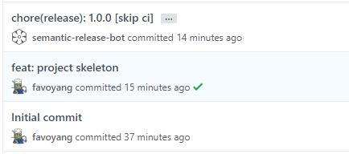
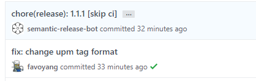
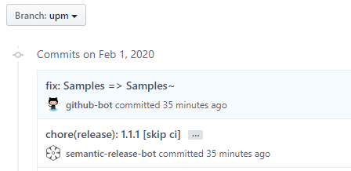
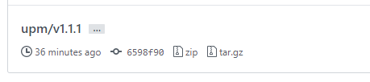

# How to Maintain UPM Package Part 2: Automating Releases with GitHub Actions

<BlogPostMeta />

This article is part of a series that discusses best practices of managing a UPM repository on GitHub. See [part 1](/blog/how-to-maintain-upm-package-part-1-7b4daf88d4c4/), [part 3](/blog/how-to-maintain-upm-package-part-3-2d08294269ad/), and [part 4](/blog/how-to-maintain-upm-package-part-4-managing-package-release-with-cli-972ff5311163/).

## Why use version control

Following [part 1](/blog/how-to-maintain-upm-package-part-1-7b4daf88d4c4/) for the series, we have created a UPM repository that can be consumed by the Unity Package Manager via git URL. It’s convenient, but with two drawbacks:

*   **Lacking version control.**When adding a package via git URL, the Unity Package Manager will resolve the package version as the latest commit, and save to the lock field of the project _manifest.json._ This is necessary to ensure consistency in a team project. But as of Unity 2019.3, the Package Manager didn’t provide a good way to update a git package, you have to manually edit the hash value, or delete the lock entry to resolve the package again.

```json
{
  "lock": {
    "com.littlebigfun.upm-ci-example": {
      "revision": "upm",
      "hash": "82adc5b54eac98e6e5789e174788c9abe68530b7"
    }
  }
}
```
*   **Lacking support for the package with git dependencies.**In other words, your custom package cannot depend on another git URL. Because a git URL which consists of a repository address and a version name (usually a branch name) is usually mutable. There is no way to lock to a specific commit unless the version name is a git tag.

The alternative way is to publish your package on a registry and use the version field of the _package.json_ to manage versions.

## Understanding semantic versioning

[Semantic versioning](https://semver.org/) (also known as SemVer) is a popular way to version a software library. It’s simply a set of rules and conventions to help define the next meaningful version string.

```text
[major].[minor].[patch]-[pre-release]

1.0.0
1.0.1-preview
1.0.2-preview.1
```
*   Major increases when the API breaks backward compatibility.
*   Minor increases when the API adds new features without breaking backward compatibility.
*   Patch increases when the API changes small things like fixing bugs or refactoring.
*   Pre-release is optional, as a label to specify a certain stage of development. The only pre-release label supported by Unity Package Manager is the _preview_, you can toggle preview packages in the list view.

Rules are cold. Semantic versioning is designed to be meaningful for other software, but not very human friendly. Humans are more comfortable with humanized versions, which deliver extra marketing information to trick our brain:

*   There’s no iPhone 9 because 2017 was the 10th anniversary of the iPhone’s original unveiling by Steve Jobs in January 2007.
*   When software versioning with year number, it builds a strong connection with the subscription pricing model.

Well, semantic versioning is not a silver bullet, but Unity forces packages to follow semantic versioning format anyway.


## Introducing semantic-release

Version management is good, but it’s not as simple as bumping a version number. To make a good release you have to do quite a few painful jobs repeatedly:

*   Bump the version number in _package.json_
*   Update the changelog file
*   Commit to git
*   Create GitHub releases (git tags) with release notes
*   Publish to a UPM registry

If you make mistakes in any step, you have to go through the checklist again, seriously slowing down your performance. [_Semantic-release_](https://github.com/semantic-release/semantic-release) is a cure by providing fully automated version management.

Semantic-release analyzes commit messages to figure out the type of changes, then automatically determines the next semantic version number, generates a changelog and publishes the release. Sounds pretty cool, right? All we need caring about is to write good commit messages the tool can understand. By default, semantic-release uses [Angular Commit Message Conventions](https://github.com/angular/angular.js/blob/master/DEVELOPERS.md#-git-commit-guidelines).

```text
<type>(<scope>): <subject>

feat: create dynamic group based on settings
fix: memory leak on mobile
docs: add badges to README
chore(release): 0.5.0
```
The type must be one of the following:

*   feat: new feature
*   fix: bug fix
*   docs: documentation only changes
*   style: changes that do not affect the meaning of the code (white-space, formatting, missing semi-colons, etc)
*   refactor: code change that neither fixes a bug nor adds a feature
*   perf: code change that improves performance
*   test: adding missing or correcting existing tests
*   chore: changes to the build process or auxiliary tools and libraries such as documentation generation

The scope is an optional field to describe the related sub-system, which can be ignored for now.

Let’s deploy the wonderful tool to our repository via GitHub's actions.

## Automating semantic-release

We’ll start with the simple case that assuming the _package.json_ is located at the root path.

Time to go shopping. Let’s deploy [Action For Semantic Release](https://github.com/marketplace/actions/action-for-semantic-release) from the GitHub marketplace, which integrates semantic-release into an easy-to-use GitHub action, by adding just two files to a repository.


**.github/workflows/ci.yml**

`.github/workflows/ci.yml`

Let's go through it step by step

*   It checks out the full git history (_fetch-depth: 0_).
*   It specifies three extra plugins to be installed with _semantic-release-action_ on the GitHub action machine. We’ll explain later.
*   It limits the semantic-release tool to run on the master branch only.
*   It provides the _GITHUB\_TOKEN_ environment variable to handle extra git command.

Nothing special, let's move on to the configuration file of semantic-release.

**.releaserc.json**

The semantic-release configuration file in JSON format. You can also use another format like [js or YAML](https://semantic-release.gitbook.io/semantic-release/usage/configuration).

`.releaserc.json`

Let's go through it step by step

*   _tagFormat_ defines the git tag format used by semantic-release to identify releases. **It should keep consistent with your existing git tags. Otherwise, your next release will be reset to 1.0.0**. For example, if your git tags (run _git tag_ to determine) use the version number without the prefix _“v”_, _tagFormat_ should be _“${version}”_.
*   _plugins_ define a list of semantic-release tasks and the execution order.
*   _@semantic-release/commit-analyzer_ determines the type of release by analyzing commits with conventional-changelog.
*   _@semantic-release/release-notes-generator_ generates release notes for the commits added since the last release to the _CHANGELOG.md_ file.
*   _@semantic-release/npm_ bumps the package.json version. The _npmPublish_ is set to _false_ to prevent to publish to the NPM registry,
*   @semantic-release/git commits the changed file (package.json, CHANGELOG.md) to git. This commit should skip the CI to avoid an endless loop by specifying “_[skip ci]_” text in the commit message.
*   _@semantic-release/github_ creates a GitHub release (git tag).

That’s it. Committing these two files to your GitHub repository, and you will see a release commit right after your normal commit.



Please remember to update your local branch before pushing the next commit.

```bash
git pull --rebase
```
**Continuous releasing**

Because almost each of your commit will get released immediately. The behavior changes your release strategy from manually releasing to continuous releasing. It’s a good thing that forces you to keep the master branch stable. WIP commits shall be organized in a separate branch, and merge back to master as a squashed commit with a clear commit message.

You can check out the example repository at [https://github.com/favoyang/semantic-release-example](https://github.com/favoyang/semantic-release-example)

## Automating semantic-release with upm branch

So what if the _package.json_ is located at a sub-folder? In [part 1](/blog/how-to-maintain-upm-package-part-1-7b4daf88d4c4/) of the series, we already managed to create an up-to-date upm branch and handle the _Samples_ folder as well. Let’s see how to integrate them with semantic-release.

**.github/workflows/ci.yml**

`.github/workflows/ci.yml`

Changed parts:

*   Step _semantic release_, specifies the id to _semantic_, to reference the action result later.
*   Step _create upm branch_, creates the upm branch and handles the _Samples_ folder. The step is even with the action step of [part 1](/blog/how-to-maintain-upm-package-part-1-7b4daf88d4c4/).
*   Step _create upm git tag_, creates an additional versioned git tag based on the upm branch, naming as `upm/vx.y.z`. To make it possible to install a specific version via git URL. This step only executes when the _semantic release_ step created a new release version.

**.releaserc.json**

`.releaserc.json`

Changed parts:

*   @semantic-release/npm, set pkgRoot to the _package.json_ directory.
*   @semantic-release/git, specify the path of _package.json_.

Committing these two files to your GitHub repository, you will see:

*   A release commit right after your commit.



*   An up-to-date upm branch.



*   An additional versioned upm tag.



You can check out the example repository at [https://github.com/favoyang/semantic-release-upm-example](https://github.com/favoyang/semantic-release-upm-example)

## Debugging semantic-release

To debug semantic-release or find out what the next release will be, you can install and dry-run semantic-release locally.

*   Install semantic-release.

```bash
npm install -g semantic-release @semantic-release/changelog @semantic-release/git
```
*   Request a personal access token ([GitHub token](https://help.github.com/en/github/authenticating-to-github/creating-a-personal-access-token-for-the-command-line)).
*   Dry-run to verify the next release.

```bash
GH_TOKEN=YOUR_GITHUB_TOKEN semantic-release --dry-run
```

## Conclusion

This tutorial went through the concept of semantic version, and how to use the semantic-release tool to automate the release process to achieve continuous releasing. The next step is to submit your package to the OpenUPM platform, which will publish packages based on git tags.

Repositories that using this (or a similar) approach:

*   [Unity addressable importer](https://github.com/favoyang/unity-addressable-importer) (_package.json_ at the root path)
*   [MirrorNG](https://github.com/MirrorNG/MirrorNG/) (_package.json_ at a sub-folder)


<BlogPostNav />
