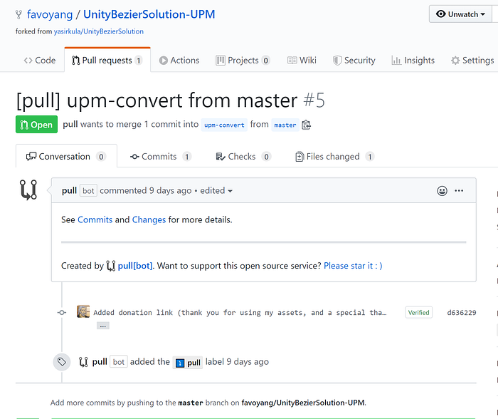
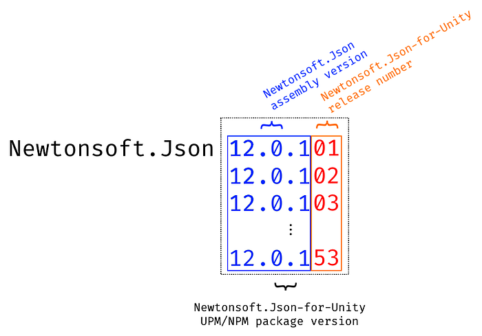

# How to Maintain UPM Package Part 3: Managing a Forked Repository

<BlogPostMeta />

This article is part of a series that discusses best practices of managing a UPM repository on GitHub. See [part 1](/blog/how-to-maintain-upm-package-part-1-7b4daf88d4c4/), [part 2](/blog/how-to-maintain-upm-package-part-2-f352fbf5f87c/), and [part 4](/blog/how-to-maintain-upm-package-part-4-managing-package-release-with-cli-972ff5311163/).

As the time of writing, 20% of packages published on the OpenUPM platform are forked from upstream repositories. One popular reason to fork a repository is that the original author doesn’t have time to maintain a UPM package. In this article, we’ll discuss how to maintain a forked repository efficiently.

## Syncing with upstream repository automatically

Fork a repository is fun, but [keep syncing changes](https://help.github.com/en/github/collaborating-with-issues-and-pull-requests/syncing-a-fork) from the upstream can be boring. Thanks to [wei/Pull app](https://github.com/apps/pull), a handy GitHub application can help us keep the fork up-to-date via automated PRs.

Fork the upstream repository as usual, then install the [Pull app](https://github.com/apps/pull).


I suggest below branch pattern to manage a fork,

*   The local master branch as a one-to-one copy of the upstream master.
*   The new upm-convert branch as our working branch to adapt the package to UPM. You can set up the upm-convert branch as the [default branch](https://help.github.com/en/github/administering-a-repository/setting-the-default-branch) to avoid confusion.

Create the upm-convert branch.

```bash
# create a branch
git checkout -b upm-convert

# sync with remote
git push -u origin upm-convert
```
Make necessary changes to add UPM support to the upm-convert branch. There’re many good tutorials around the Internet, so we will just cover the basics.

*   Make sure the upstream repository has an open-source license.
*   Fork the upstream repository.
*   Pick a suitable package name, add package.json and [asmdef files](https://gametorrahod.com/how-to-asmdef-upm/).
*   Test your UPM package.

Add file `.github/pull.yml` as below.

*   Whenever the upstream master branch is updated, the local master branch will be synced. The `hardreset` merge method will wipe any local changes to keep identical. Notice that as a free service, the Pull GitHub app triggers every couple of hours, but there’s an option to [trigger it manually](https://github.com/wei/pull#trigger-manually).
*   Whenever the local master is updated, the app will create a PR to merge to the upm-convert branch. If you don’t merge the PR, it will keep update with upstream changes until you merge it.



Example PR created by Pull app

*   Review the changes and merge them into the upm-convert branch.
*   If the upm-convert branch is not a flat package, you can create the upm branch by following [this article](/blog/how-to-maintain-upm-package-part-1-7b4daf88d4c4/).

## Version control

The version control strategy can vary depending on the upstream repository.

If the upstream doesn’t have any version control, or you have dramatically changed the repository content, you can create your own versions.

If the upstream already has version control, it’s better to keep consistent with it. But how to present your changes to an existing upstream version? Two tactics:

*   Use a prerelease identifier: `major.minor.patch-[prerelease-identifier].build` (e.g. `3.1.0-rc.1`, `3.1.0-preview.1` or `3.1.0-post.1`). It works, but a version with this pattern is considered a prerelease. Thus, it won't list as a newer version in the UPM window comparing with the version without a prerelease identifier (e.g. `3.0.0`>`3.0.0-rc.1`). The workaround is that always release with a prerelease-identifier.
*   Use a transformed patch number: `major.minor.patch` with 2 extra digits appended to the patch number (e.g. `3.1.1` transforms into `3.1.101`, `3.1.102`…). See the image borrowed from the [jillejr.newtonsoft.json-for-unity](/packages/jillejr.newtonsoft.json-for-unity/) package below.

It works with one “glitch” when the upstream patch number is zero. If the original version is`3.0.0`your version will be`3.0.1`, `3.0.2`... Because `3.0.001` transforms into `3.0.1` during the npm publishing. It can be slightly confusing but won’t be conflicted.



The transformed patch number

<BlogPostNav />
