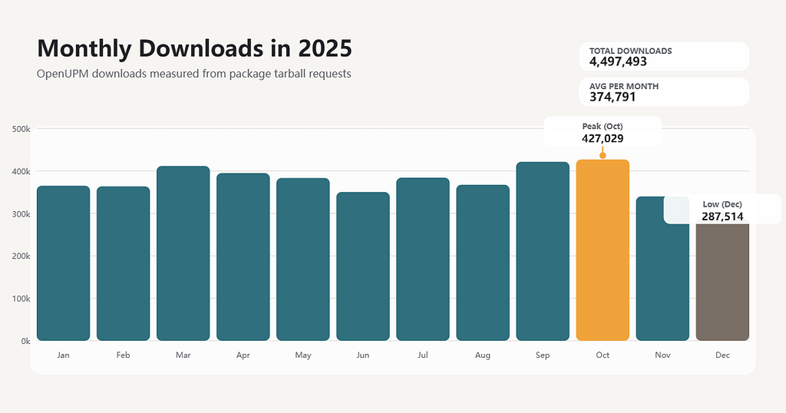
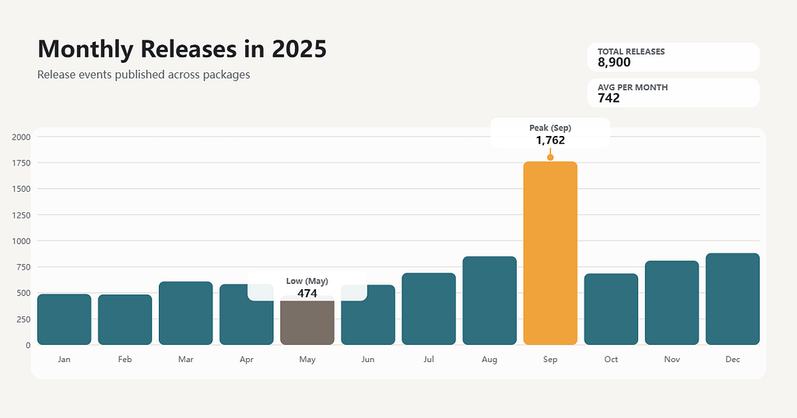

# OpenUPM 2025 Recap

<BlogPostMeta />

2025 was a year of steady consolidation for OpenUPM. Submissions dipped a bit, downloads eased slightly, but the community kept shipping and release activity surged in the fall. Here’s a clear summary of what changed.
<h2>Community in 2025</h2><ul><li>489 packages submitted, down from 618 in 2024.</li><li>218 unique package hunters and 232 unique owners, still a strong and active creator base year‑over‑year.</li><li>Creator‑led submissions hit a new high: 336 packages (68.7%) were submitted by their own owners.</li></ul><h2>Downloads: a small dip, strong monthly shape</h2><ul><li>Total downloads: 4,497,493 (‑11.1% vs 2024).</li><li>Monthly volume averaged about 374,791 downloads, staying steady through the year, peaking in October (427,029) and September (421,651), then dipping in December (287,514), likely reflecting the year‑end holiday slowdown.</li></ul><figure></figure>
Top 10 downloaded packages:
<ol><li>External Dependency Manager for Unity (<a href="/packages/com.google.external-dependency-manager/">com.google.external-dependency-manager</a>) — 589,537</li><li>UI Particle (<a href="/packages/com.coffee.ui-particle/">com.coffee.ui-particle</a>) — 342,587</li><li>VContainer (<a href="/packages/jp.hadashikick.vcontainer/">jp.hadashikick.vcontainer</a>) — 310,184</li><li>UniTask (<a href="/packages/com.cysharp.unitask/">com.cysharp.unitask</a>) — 289,844</li><li>NuGetForUnity (<a href="/packages/com.github-glitchenzo.nugetforunity/">com.github-glitchenzo.nugetforunity</a>) — 267,166</li><li>Compilation Visualizer (<a href="/packages/com.needle.compilation-visualizer/">com.needle.compilation-visualizer</a>) — 136,023</li><li>Google Play Common (<a href="/packages/com.google.play.common/">com.google.play.common</a>) — 110,713</li><li>Google Play Core (<a href="/packages/com.google.play.core/">com.google.play.core</a>) — 95,834</li><li>Google Play In-app Review (<a href="/packages/com.google.play.review/">com.google.play.review</a>) — 89,527</li><li>Backtrace (<a href="/packages/io.backtrace.unity/">io.backtrace.unity</a>) — 67,358</li></ol><h2>Fastest-growing packages</h2>
Top 10 fastest-growing packages in 2025 (by %, min 2024 downloads: 100). Format: growth rate — current vs 2024:
<ol><li>Google Play Integrity (<a href="/packages/com.google.play.integrity/">com.google.play.integrity</a>) — 11,341.0% (24,026 vs 210)</li><li>Google Play Common (<a href="/packages/com.google.play.common/">com.google.play.common</a>) — 4,169.7% (110,713 vs 2,593)</li><li>Google Play In-app Updates (<a href="/packages/com.google.play.appupdate/">com.google.play.appupdate</a>) — 3,737.8% (15,428 vs 402)</li><li>Google Play In-app Review (<a href="/packages/com.google.play.review/">com.google.play.review</a>) — 3,714.5% (89,527 vs 2,347)</li><li>Google Play Core (<a href="/packages/com.google.play.core/">com.google.play.core</a>) — 3,652.3% (95,834 vs 2,554)</li><li>Nice Vibrations (<a href="/packages/com.github.lofelt.nicevibrations/">com.github.lofelt.nicevibrations</a>) — 2,659.9% (4,471 vs 162)</li><li>AppMetrica (<a href="/packages/io.appmetrica.analytics/">io.appmetrica.analytics</a>) — 2,017.6% (7,348 vs 347)</li><li>UnitySkiaSharp (<a href="/packages/com.u2sb.skiasharp/">com.u2sb.skiasharp</a>) — 1,834.0% (2,727 vs 141)</li><li>MvpToolkit (<a href="/packages/com.behc.mvptoolkit/">com.behc.mvptoolkit</a>) — 1,759.9% (3,199 vs 172)</li><li>Adjust (<a href="/packages/com.adjust.sdk/">com.adjust.sdk</a>) — 1,566.6% (6,083 vs 365)</li></ol><h2>Trending packages</h2>
Top 10 trending downloaded packages in 2025 (vs 2024):
<ol><li>External Dependency Manager for Unity (<a href="/packages/com.google.external-dependency-manager/">com.google.external-dependency-manager</a>) — +333,557 (130.3% from 255,980)</li><li>NuGetForUnity (<a href="/packages/com.github-glitchenzo.nugetforunity/">com.github-glitchenzo.nugetforunity</a>) — +215,026 (412.4% from 52,140)</li><li>Google Play Common (<a href="/packages/com.google.play.common/">com.google.play.common</a>) — +108,120 (4,169.7% from 2,593)</li><li>Google Play Core (<a href="/packages/com.google.play.core/">com.google.play.core</a>) — +93,280 (3,652.3% from 2,554)</li><li>Google Play In-app Review (<a href="/packages/com.google.play.review/">com.google.play.review</a>) — +87,180 (3,714.5% from 2,347)</li><li>VContainer (<a href="/packages/jp.hadashikick.vcontainer/">jp.hadashikick.vcontainer</a>) — +70,071 (29.2% from 240,113)</li><li>UI Particle (<a href="/packages/com.coffee.ui-particle/">com.coffee.ui-particle</a>) — +69,379 (25.4% from 273,208)</li><li>PlayableGraphMonitor! (<a href="/packages/com.greenbamboogames.playablegraphmonitor/">com.greenbamboogames.playablegraphmonitor</a>) — +34,412 (864.2% from 3,982)</li><li>Google Mobile Ads for Unity (<a href="/packages/com.google.ads.mobile/">com.google.ads.mobile</a>) — +24,970 (67.8% from 36,808)</li><li>AltTester Unity SDK (<a href="/packages/com.alttester.sdk/">com.alttester.sdk</a>) — +24,761 (412.7% from 6,000)</li></ol><h2>New packages making noise</h2>
Top 10 new packages by downloads:
<ol><li>ZLinq (<a href="/packages/com.cysharp.zlinq/">com.cysharp.zlinq</a>) — 5,218</li><li>AI Game Developer — MCP (<a href="/packages/com.ivanmurzak.unity.mcp/">com.ivanmurzak.unity.mcp</a>) — 4,940</li><li>HierarchyFinder (<a href="/packages/io.github.hatayama.hierarchyfinder/">io.github.hatayama.hierarchyfinder</a>) — 3,334</li><li>InspectorAutoAssigner (<a href="/packages/io.github.hatayama.inspectorautoassigner/">io.github.hatayama.inspectorautoassigner</a>) — 2,973</li><li>CleanFormerlySerializedAs (<a href="/packages/io.github.hatayama.cleanformerlyserializedas/">io.github.hatayama.cleanformerlyserializedas</a>) — 2,783</li><li>MCP for Unity (<a href="/packages/com.coplaydev.unity-mcp/">com.coplaydev.unity-mcp</a>) — 2,367</li><li>Mirage Steamworks.net Socket (<a href="/packages/com.miragenet.steamworkssocket/">com.miragenet.steamworkssocket</a>) — 1,557</li><li>Cursor Editor (<a href="/packages/com.boxqkrtm.ide.cursor/">com.boxqkrtm.ide.cursor</a>) — 1,215</li><li>AddressablesLoader (<a href="/packages/com.realitygames.addressablesloader/">com.realitygames.addressablesloader</a>) — 1,198</li><li>Instant Replay (<a href="/packages/jp.co.cyberagent.instant-replay/">jp.co.cyberagent.instant-replay</a>) — 1,105</li></ol><h2>Topics users cared about</h2>
By downloads, the top categories were:
<ul><li>Utilities</li><li>Editor Enhancement</li><li>Package Management</li><li>Integration</li><li>GUI</li></ul><h2>AI packages got real usage</h2>
Top 5 AI packages by downloads:
<ol><li>OpenAI (<a href="/packages/com.openai.unity/">com.openai.unity</a>) — 7,058</li><li>AI Game Developer — MCP (<a href="/packages/com.ivanmurzak.unity.mcp/">com.ivanmurzak.unity.mcp</a>) — 4,940</li><li>ElevenLabs (<a href="/packages/com.rest.elevenlabs/">com.rest.elevenlabs</a>) — 4,551</li><li>MCP for Unity (<a href="/packages/com.coplaydev.unity-mcp/">com.coplaydev.unity-mcp</a>) — 2,367</li><li>Theymes SDK (<a href="/packages/com.theymes.sdk/">com.theymes.sdk</a>) — 614</li></ol>
It’s still early, but AI tooling clearly entered the Unity package landscape in 2025.
<h2>Releases: a late‑year surge</h2>
Release activity accelerated sharply, averaging about 742 releases per month:
<figure></figure><ul><li>September: 1,762 releases (the year’s peak).</li><li>December: 882 releases, also notably high.</li></ul>
Top 5 packages by release count:
<ol><li>Rive (<a href="/packages/app.rive.rive-unity/">app.rive.rive-unity</a>) — 1,234</li><li>PurrNet (<a href="/packages/dev.purrnet.purrnet/">dev.purrnet.purrnet</a>) — 326</li><li>SaintsField (<a href="/packages/today.comes.saintsfield/">today.comes.saintsfield</a>) — 212</li><li>Purrdiction (<a href="/packages/dev.purrnet.purrdiction/">dev.purrnet.purrdiction</a>) — 162</li><li>VRCFury (<a href="/packages/com.vrcfury.vrcfury/">com.vrcfury.vrcfury</a>) — 151</li></ol><h2>Takeaways</h2>
2025 looked like a “maturity” year: fewer new submissions, but stronger creator ownership and a huge burst of maintenance and iteration in the second half. The ecosystem is steady, with clear signals around utilities, editor tooling, and a rising wave of AI packages. If 2025 was about refinement, 2026 looks poised for expansion.

Notes: Download counts are calculated from the package tarball endpoint. Automated traffic is rate limited but hard to fully exclude, so treat the numbers as directional guidance. This is true for most stats services.

<BlogPostNav />
