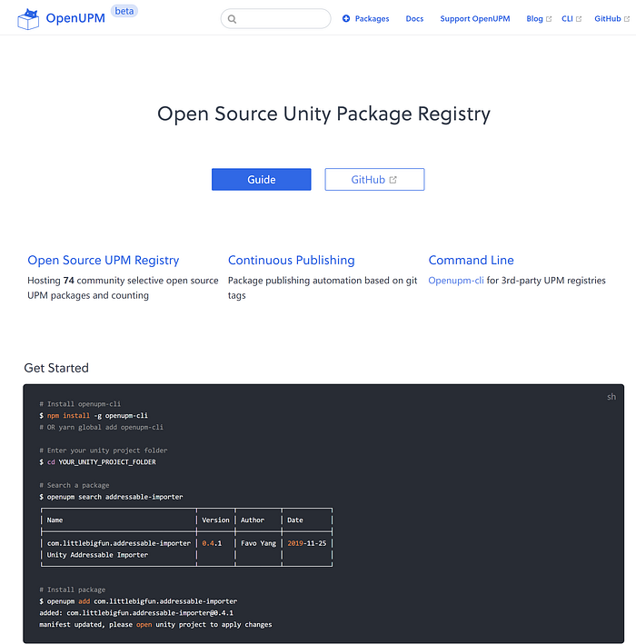

# OpenUPM Beta is Now Available

<BlogPostMeta />

Hey Unity Developers,

It’s been a while since [the first leak](https://forum.unity.com/threads/awesome-upm-a-list-of-git-repositories-for-unity-that-support-unity-package-manager-upm.745940/#post-4975808) on the unity forum. For the past few months, I’ve been working on this hobby project. I’m glad that the [OpenUPM service](/) reaches the beta stage!

screenshot of openupm.com

OpenUPM is a service for hosting and building open source unity package manager (upm) packages. It’s composed of two parts: **a managed upm package registry with automatic build pipelines.** The intention is to create a universal platform to discover, share and distribute open-source upm packages, and a community along with it.

The major difference between OpenUPM and other 3rd-party upm registry is that the service does not require the project owners to submit package updates regularly. Instead, it maintains a curated list of upm repository and enables any GitHub users (called packager hunter) to discover and submit upm repositories to the list. The automatic build pipelines monitor the changes and publish new releases later then. The unique approach helps grow the platform with the community.

Beta features:

*   Public OpenUPM registry hosting 75 upm packages as of December 2019
*   Automatic build pipelines
*   Dedicated [openupm-cli](https://github.com/openupm/openupm-cli#openupm-cli) for 3rd-party upm registries

During the beta stage, My major focus will be

*   Improving service performance and stability
*   Improving package verification
*   Fixing bugs
*   Growing the community

A special thanks for [S. Tarık Çetin (starikcetin)](https://github.com/starikcetin) who maintains [awesome-upm](https://github.com/starikcetin/awesome-upm) project collecting a great list of open-source upm packages.

If the project looks interesting for you, feel free to

Happy coding!

<BlogPostNav />
