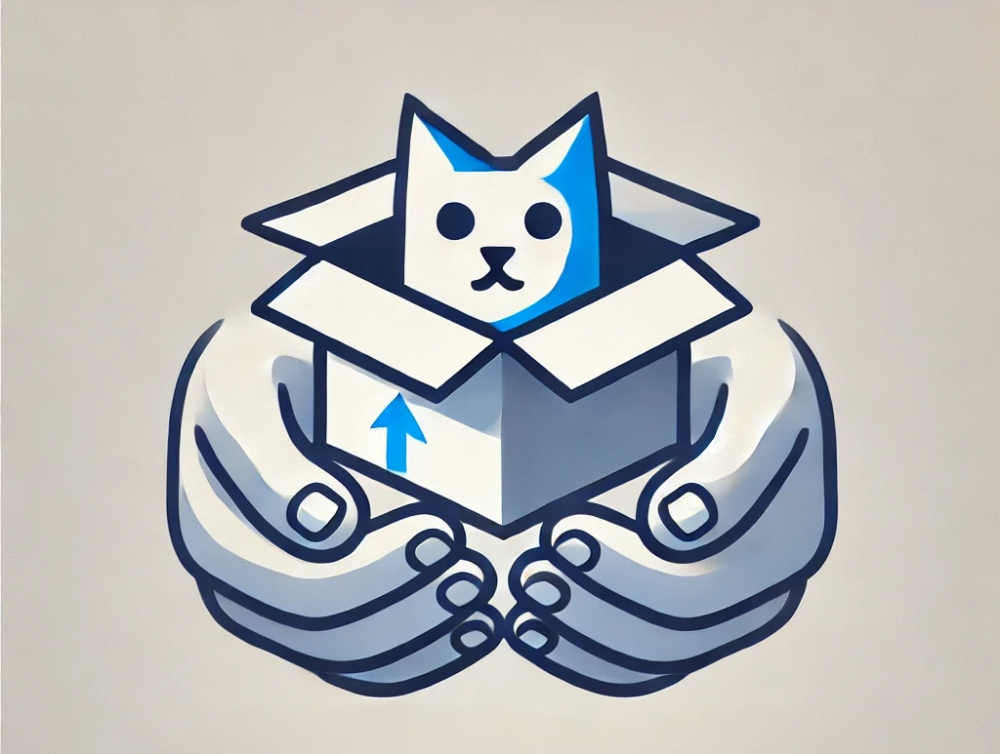

# OpenUPM Launches Alternative UnityNuGet Registry

<BlogPostMeta />

OpenUPM now hosts an alternative endpoint for the UnityNuGet registry. Alexandre Mutel ([@xoofx](http://github.com/xoofx)) has resigned from Unity, and the UnityNuGet Azure feed is scheduled to stop on March 10. Thank you to Alexandre for creating UnityNuGet and keeping it useful for so many Unity projects.

## What changes

The alternative registry is available at:
[**https://unitynuget-registry.openupm.com/**](https://unitynuget-registry.openupm.com/)

The service tracks the latest UnityNuGet Docker image and receives regular updates. It currently runs on a small server, so we will watch usage and add capacity if traffic requires it.

The main OpenUPM registry now uplinks to this UnityNuGet endpoint, so existing OpenUPM uplink users can keep resolving org.nuget packages through OpenUPM.

## UnityNuGet maintenance

Borja Domínguez ([@bdovaz](https://github.com/bdovaz)) continues to maintain the UnityNuGet project. Developers can still submit NuGet packages to the curated list at:
[**https://github.com/xoofx/UnityNuGet/blob/master/registry.json**](https://github.com/xoofx/UnityNuGet/blob/master/registry.json)

## How to support the service

OpenUPM runs on a limited budget. If this registry helps your project, you can support it through [Patreon](https://www.patreon.com/openupm), [GitHub Sponsors](https://github.com/sponsors/openupm), or [PayPal](https://www.paypal.com/paypalme/favoyang).

*References:* [*UnityNuGet Issue #480*](https://github.com/xoofx/UnityNuGet/issues/480) | [*OpenUPM NuGet Registry*](/nuget/)

OpenUPM is hosted on DigitalOcean. Our [DigitalOcean referral link](https://m.do.co/c/50e7f9860fa9) includes a $200 onboarding credit valid for 60 days.

<BlogPostNav />
