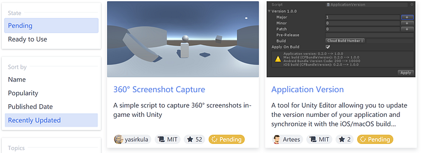
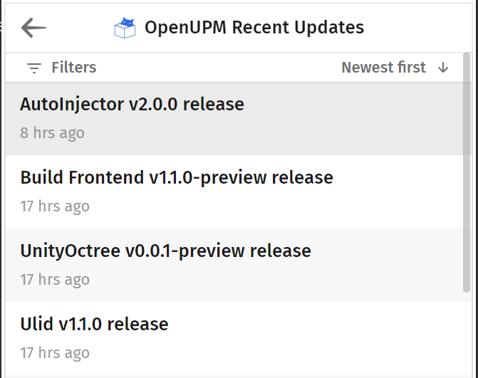
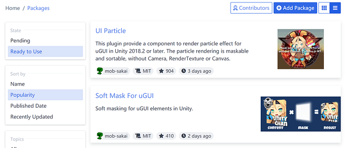

# OpenUPM Round-up

<BlogPostMeta />

I haven’t given an update for OpenUPM in 2020. Turns out there’re quite a lot of things happened quietly. I will cover both stats and major features in this article.

## OpenUPM Stats

*   263 community selective open-source UPM packages.
*   5 Backers: [Mike Wuetherick](https://github.com/gekidoslair), [Takumi Ito](https://github.com/t5ujiri), [Vatsal Ambastha](https://github.com/adrenak), [JohannesDeml](https://github.com/JohannesDeml), and [Sas van der Westhuizen](https://github.com/sasvdw). Special thanks for all these amazing supporters.
*   186 [GitHub stars](https://github.com/openupm/openupm). Want to support OpenUPM without cost? Just star it.
*   4000 builds. That’s a lot.

Top package hunters

*   54 package hunters. [Jesse Talavera-Greenberg](https://github.com/JesseTG) tops the list with 87 projects.
*   180 package owners. [S. Tarık Çetin](https://github.com/starikcetin) tops the list with 32 packages, followed by [Pixel Wizards](https://github.com/PixelWizards) and [iDreamsOfGame](https://github.com/iDreamsOfGame).

I think we’re doing well for early 2020. It’s a hard time for most of us, but people still contribute a lot to the open-source community. That’s lovely and appreciated.

OpenUPM is also open to sponsorship. If you run a business and is using OpenUPM in a revenue-generating product, it would make business sense to sponsor OpenUPM development: it ensures the project that your product relies on stays healthy and actively maintained. It can also help your exposure in the OpenUPM community and makes it easier to attract Unity developers. Check out full benefits at [patreon.com/openupm](https://www.patreon.com/openupm).

Next, we’ll talk about features and bug fixes.

**Pending Packages**

One thing makes the OpenUPM truly awesome is that everyone can hunt their favorite open-source packages to submit to the platform. But on another side, without the package owner involved in the first place, the package may be not ready to use. One common issue is missing the Git tag to work with. To make it clear and save your time while browsing packages, a pending label is added if a package has no release yet.

Pending packages

## RSS Feed

Tracking package updates are now possible with the RSS feed [/feeds/updates/rss](/feeds/updates/rss).

OpenUPM Recent Updates Feed

## One-column Layout

The masonry layout is a bit messy. It is replaced by a two-columns fixed height layout. We also introduced a good old-fashioned single column lister suggested by [Andy Baker](https://github.com/andybak). The option (at the right top) is persistent with your browser storage, so you only need to click that button once.

One-column layout

## More Sort Options

You can now sort the package list by first _Published Date_ or _Recently Updated_ date.

## Support Social Image

Package owners can add a social image to their repository. The image will be crawled every half hour and replaces the image URL from the YAML file.

## Support README.md at Custom Location

Package hunters can specify a README.md file location in the YAML file. This solves the issue that a monorepo project will have different README.md files for different sub-packages.

For more misc improvements, please check out the [CHANGELOG.md](https://github.com/openupm/openupm/blob/master/CHANGELOG.md).

## Next?

It’s not the first time that I’ve heard the following expression “Thanks for creating OpenUPM”, which motivated me, to see developers are using the platform and get benefits from it.

OpenUPM is not only a UPM registry but also a very low friction way to add package management to your workflow, by simply adding Git tags or perhaps using CI to fully automate it. I’m very happy to see that the Unity open-source community is growing with us, and following good practices and leave developers more time to focus on the software itself. Writing software is fun, package management should be simple. There are still quite a few open issues on the OpenUPM and OpenUPM-CLI GitHub projects, I will keep you update.

Stay safe, stay tuned.

<BlogPostNav />
