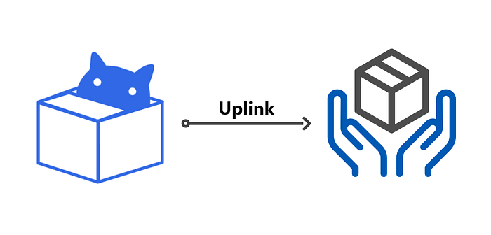

# OpenUPM Uplinks to the UnityNuGet Registry

<BlogPostMeta />

[NuGet](https://docs.microsoft.com/en-us/nuget/what-is-nuget) is the package manager for .NET, designed to enable developers to share fundamental reusable code. Many UPM packages use NuGet packages as embed DLLs. The practice gets troubled when two packages included the same DLL or different versions of one NuGet package. It’s a frequently asked question in the [OpenUPM discussion](https://github.com/openupm/openupm/discussions/553) and the Unity forum.

The solution is to create a shared NuGet package in the UPM format that everyone can depend on.

Thanks to [xoofx](https://github.com/xoofx)’s [UnityNuGet](https://github.com/xoofx/UnityNuGet) which is a project that provides a service to bundle NuGet packages into the UPM format. Similar to OpenUPM, UnityNuGet maintains a [curated list](https://github.com/xoofx/UnityNuGet/blob/master/registry.json) of NuGet packages. All packages list there should be available on a registry at [https://unitynuget-registry.azurewebsites.net.](https://unitynuget-registry.azurewebsites.net./) The NuGet Registry takes care of packaging up these NuGet packages in a consistent, automated way, uses proper package naming under the `org.nuget` scope.

**As an experimental feature, the OpenUPM registry**[**uplinks**](https://verdaccio.org/docs/en/uplinks)**to the UnityNuGet registry to make it easier to use a NuGet package for OpenUPM audiences.**

OpenUPM Uplinks to UnityNuGet

## Uplink Features and Limitations

The uplink feature provides

*   OpenUPM registry sync with UnityNuGet registry hourly.
*   Cached tarballs are hosting on CDN as well.
*   You can view package detail via openupm-cli `openupm view org.nuget.some-package`.

The integration comes with a few limitations.

*   NuGet packages are not searchable or browseable on the OpenUPM website.
*   Search for NuGet packages via OpenUPM registry’s search endpoint will result in “404 packages not found”. This affects both openupm-cli’s search command and Unity PackMan’s search feature.

As a side-effect of the search issue,

*   NuGet packages will be invisible in Unity PackMan’s “My Registries” section, but still visible on the “In Project” section.
*   Unity console may warn “Error searching for packages” the first time open the PackMan.

The search issue may be resolved with an improved search endpoint behavior in the future.

## Demo

Please check out the demo project at [https://github.com/favoyang/com.example.nuget-consumer](https://github.com/favoyang/com.example.nuget-consumer).

## What’s next?

Package maintainers could

*   Learn more about the integration at [https://openupm.cn/nuget/](https://openupm.cn/nuget/).
*   Test the integration and migrate to depends on these NuGet packages.
*   Give feedback to the integration on [https://github.com/openupm/openupm/issues/1976](https://github.com/openupm/openupm/issues/1976)
*   Join the [discussion](https://github.com/openupm/openupm/discussions/553) to propose different solutions for NuGet integration.
*   Consider sponsoring UnityNuGet at [https://github.com/sponsors/xoofx](https://github.com/sponsors/xoofx).

<BlogPostNav />
