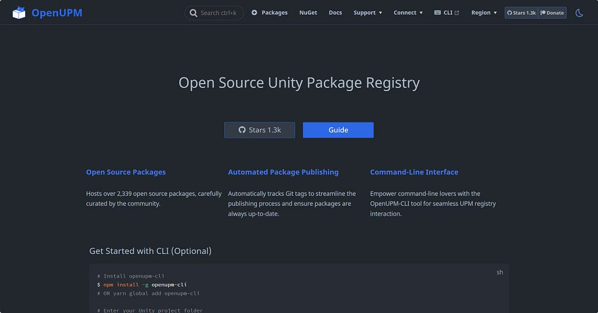
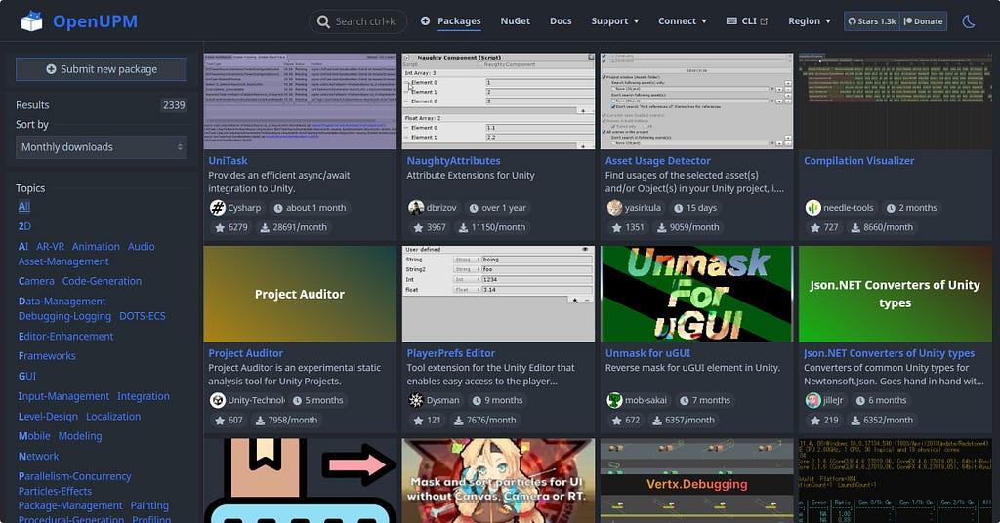
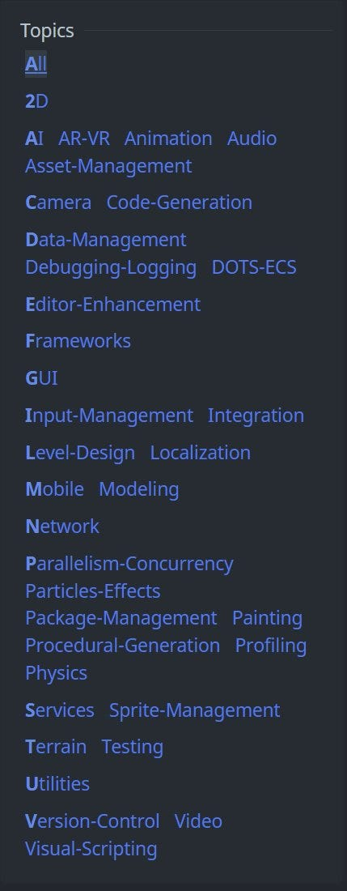
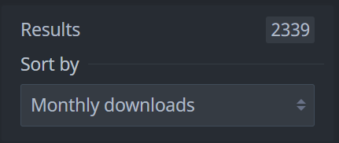
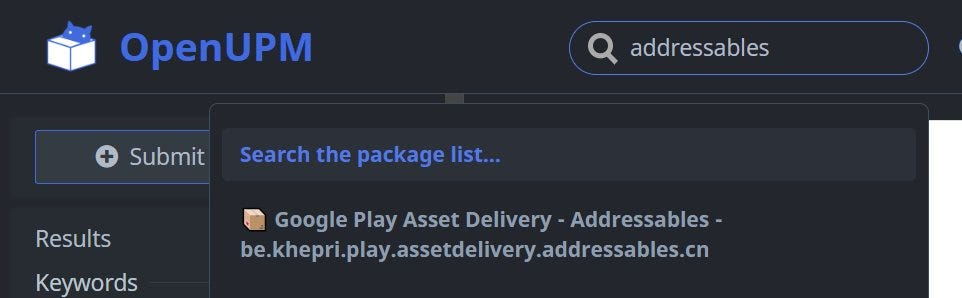
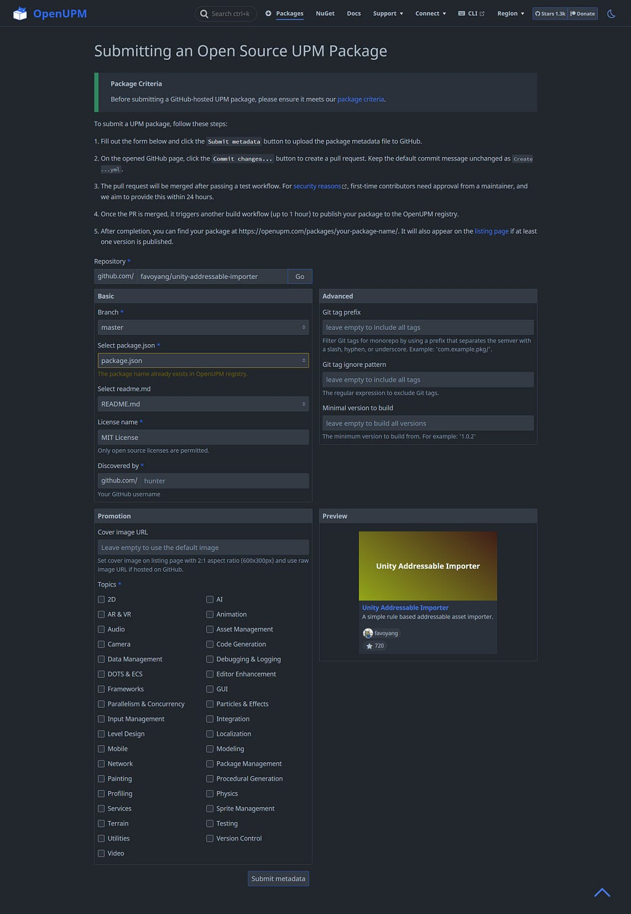
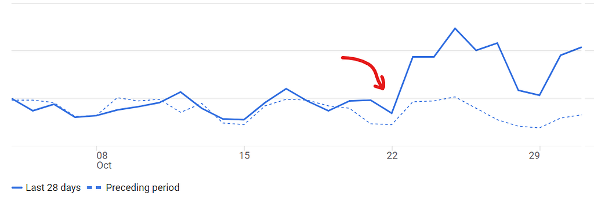

# OpenUPM x Hacktoberfest 2023 Round-ups

<BlogPostMeta />

Unity had a rough month, and many Unity developers were watching the ecosystem more closely than usual. OpenUPM used Hacktoberfest 2023 to ship several site improvements that had been waiting in the queue.

OpenUPM now has a dark theme for late-night browsing.

*OpenUPM Dark Theme*

The package list also received a more consistent layout.

*New Designed Package List*

Package list scrolling now uses virtualization. That keeps memory usage stable when browsing long result sets and avoids the crashes some users hit with the old list.

Topics and categories are easier to scan now.

*New Designed Topic List*

OpenUPM can sort packages by monthly downloads, which makes popular packages easier to find.

*Sort Packages by Monthly Downloads*

The package list now supports keyword filtering.

*Search by Keywords*

The package add form now shows a package card preview, so maintainers can check what they are about to submit.

*New Designed Package Add Form*

The site has also moved to [vuepress-next](https://github.com/vuepress/vuepress-next), and parts of the codebase now use TypeScript.

ComradeVanti migrated openupm-cli to TypeScript in pull request [#52](https://github.com/openupm/openupm-cli/pull/52). That was a useful contribution on its own, and ComradeVanti is also one of our backers.

Traffic increased after the redesigned site launched.

*The Views Bump Up Since the Launch of the Revamped Website*

OpenUPM remains an independent service. Unity is not involved in sponsorship or development. The project is backed by individual developers who care about game development and open source packages, and that support matters when the wider Unity ecosystem feels uncertain.

If you appreciate the work, you can sponsor OpenUPM on Patreon at [patreon.com/openupm](https://www.patreon.com/openupm).

<BlogPostNav />
