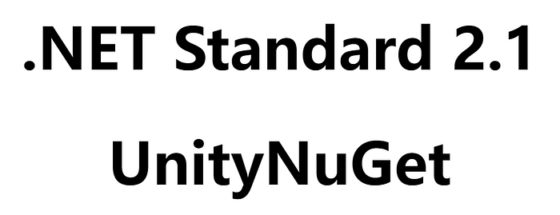
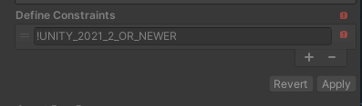
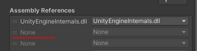

# Registry Changes to Conform to .NET Standard 2.1 Shipped with Unity 2021.2

<BlogPostMeta />



TLDR: If your project relies on UnityNuGet packages and plans to upgrade to Unity 2021.2, you need to clean both the project-level package cache and the global registry cache to force Unity to resolve and re-download UnityNuGet packages. Since OpenUPM uplinks to the UnityNuGet registry, we get affected as well.

To clean the project-level package cache, remove folders at

```text
YOUR_PROJECT/Library/PackageCache/org.nuget.*
```
To clean the global registry cache, remove folders at

For Windows:

```text
%LOCALAPPDATA%/Unity/cache/npm/package.openupm.com/org.nuget.*
%LOCALAPPDATA%/Unity/cache/npm/unitynuget-registry.azurewebsites.net
```
For other OS, please check out [https://docs.unity3d.com/Manual/upm-cache.htm](https://docs.unity3d.com/Manual/upm-cache.htm) to locate the global cache folder.

After the changes, you’re ready to upgrade to Unity 2021.2.

You can stop here if you’re not curious about details.

Behind the scenes is that Unity updates their .NET profile to _.NET Standard 2.1_ for Unity 2021.2, which adds more .NET APIs to the Unity core engine to conform to the standard. And that brings some trouble for packages shipped with duplicated APIs.


It’s very easy to get confused by .NET, .NET Core, .NET Standard, .NET Framework, Mono, and so on. I’m not going to reveal the full story here. In a short, .NET Framework is the first .NET implementation back in 2000. While other forms of .NET implementations appear later like .NET Core, Mono, Xamarin… To keep things from getting too fragmented. Microsoft created an API standard called _.NET Standard_. And other implementations shall claim compatibility with .NET Standard versions from 1.0 to 2.1. In 2020, Microsoft changed the game again, introducing _.NET 5_ as a single product with a uniform set of capabilities and APIs. It is both a standard and a runtime implementation to allow Microsoft to move fast in .NET standards and features. Anyway, since Unity has a slow pace to follow new .NET features it’s likely we’re going to deal with .NET Standard 2.1 for a long time.

When it comes to Unity before Unity 2021.2 the API compatibility level settings provide two profiles: _.NET Standard 2.0_ and _.NET Framework 4.x_. Since Unity 2021.2 the API compatibility level settings upgraded these two profiles to _.NET Standard 2.1_ and _.NET Framework_. It could be a little confusing for mixing a standard (.NET Standard) and a runtime (.NET Framework) as two choices. But as the profile name suggested the first one has better cross-platform compatibility, the second one has more .NET APIs available.

Now back to the UnityNuGet issue. UnityNuGet packs NuGet DLLs and converts them to UPM package format for Unity to consume. It used to add _NET\_STANDARD\_2\_0_ in Define Constraints for all packages. This constraint will prevent a DLL from being loaded with a different .NET profile. So all the packages suddenly stop working in Unity 2021.1 which shipped with a .NET Standard 2.1 profile. UnityNuGet rebuilt all packages to remove this constraint. OpenUPM caught up later, flashed the cache of UnityNuGet. I’m sorry for the inconvenience, it’s something we have to do to fix the issue.

You probably know that .NET Standard 2.1 introduces new language features like Span&lt;T&gt; that’s been implemented in the NuGet package System.Memory. If your project has a NuGet System.Memory DLL, it cannot compile with Unity 2021.2. Unity addressed the issue and added all APIs from System.Memory DLL to its .NET Standard 2.1 profile. The System.Memory DLL is no longer needed. To respect the changes, UnityNuGet adds the _!UNITY\_2021\_2\_OR\_NEWER_ Define Constraint for package _org.nuget.system.memory_ to prevent it from being loaded in Unity 2021.2.



_!UNITY\_2021\_2\_OR\_NEWER_ Define Constraint

If you have an Assembly Definition references these DLLs in an unsupported environment, it will display as None.



Referenced DLLs in an unsupported environment

For package maintainers, if you have a package that includes a System.Memory DLL manually but need it to be compatible with both Unity 2021.2 and earlier versions, use the _!UNITY\_2021\_2\_OR\_NEWER_ Define Constraint. Or consider migrating your package to depend on UnityNuGet. Since OpenUPM uplinks to UnityNuGet, there should be less pain to communicate with your users to just add “org.nuget” to the scope attribute of manifest.json.

A reminder for the _system.runtime.compilerservices.unsafe_ DLL, it used to be included in Unity’s .NET Standard 2.1 profile by mistake and [has been removed](https://issuetracker.unity3d.com/issues/using-a-net-standard-2-dot-1-dll-that-references-system-dot-runtime-dot-compilerservices-dot-unsafe-via-nuget-results-in-missingmethodexception). The _org.nuget.system.runtime.compilerservices.unsafe_ package should stay without change.

Thanks to Alexandre Mutel (@xoofx) to fix the issue. Check out [UnityNuGet](/nuget/) if you need a modern way to manage the NuGet references.

References:

*   [Announcing .NET Standard 2.1](https://devblogs.microsoft.com/dotnet/announcing-net-standard-2-1/)
*   [.NET Standard, .NET implementation and .NET 5](https://docs.microsoft.com/en-us/dotnet/standard/net-standard#net-5-and-net-standard)
*   [Unity Future .NET Development Status](https://forum.unity.com/threads/unity-future-net-development-status.1092205/)

<BlogPostNav />
