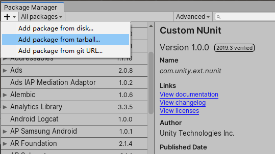
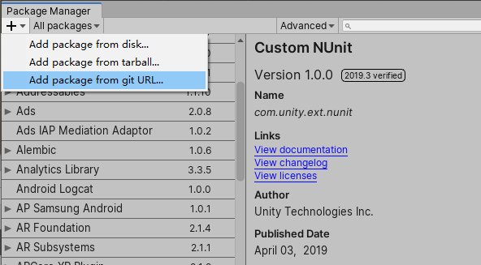
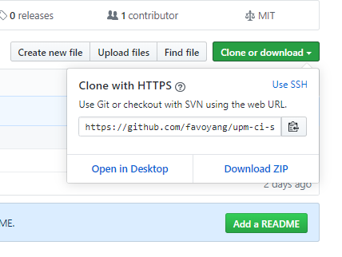
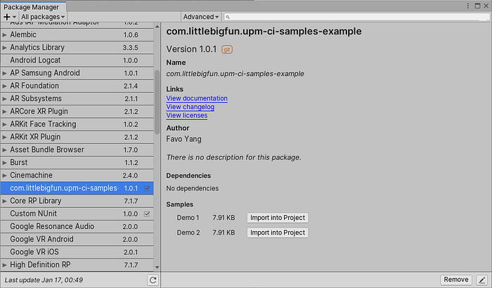
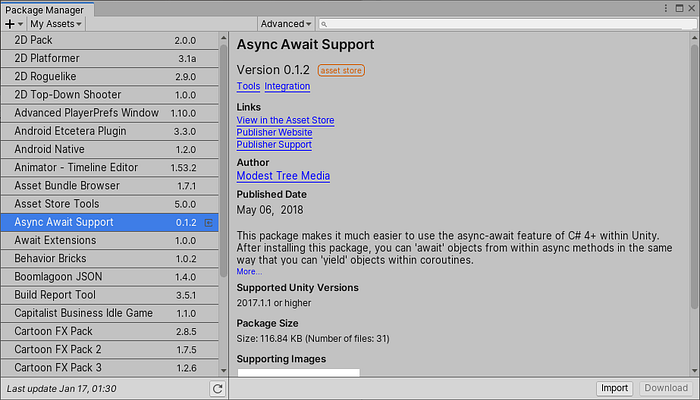

# Unity Package Manager 2019.3 Round-up

<BlogPostMeta />


While it’s already January 2020, but we haven’t seen the official release of Unity 2019.3 yet. Unity 2019.3 is surely a large and complex release. The good news is that with the [candidate 5](https://blogs.unity3d.com/2019/12/12/2019-3-is-now-in-the-final-stages-of-beta-testing/?_ga=2.18667065.1632946654.1578841410-134253320.1574534508), 2019.3 is now in the final stages of beta testing.


We’ll go through the changes of the Unity Package Manager, which is mostly related to the OpenUPM project.

## Add a package from tarball



There’re a few scenarios you’ll prefer to install from a binary file:

*   Purchasing package from a private source, which usually providing a link to download a tarball file.
*   Sharing a package temporarily, like the way it used to be with _.unitypackage_ file.

To create a tarball file:

```bash
cd YOUR_PACKAGE_FOLDER
npm pack
```
The profile manifest references a tarball package with file protocol:

```json
{
  "dependencies": {
    "package-name": "file:PATH_TO_TARBALL.tgz"
  }
}
```
The package contents are extracted to _Library/PackageCache/package-name@hash_. Hence, the package is immutable for the Unity editor.

## Add a package from Git URL



A missing feature for a long time, now you can install a package from Git URL. You cannot directly copy your public GitHub URL from the browser address bar. You need to copy it from the _Clone or download_ dialog. Basically the URL needs end with _.git_. To specify a branch, use _#branch-name_.



I wish the package manager can be smarter while handling the Git URL.

```text
https://github.com/favoyang/upm-ci-samples-example                 # invalid
https://github.com/favoyang/upm-ci-samples-example.git             # valid
https://github.com/favoyang/upm-ci-samples-example/tree/upm        # invalid
https://github.com/favoyang/upm-ci-samples-example.git#upm         # valid
```



The package detail view of a Git package

After adding a Git URL, a lock entry was added to the project _manifest.json_, with Git commit hash recorded. This entry makes sure every project checkout will install the same version (hash).

```json
{
  "dependencies": {
    "com.littlebigfun.upm-ci-samples-example": "https://github.com/favoyang/upm-ci-samples-example.git#upm"
  },
  "lock": {
    "com.littlebigfun.upm-ci-samples-example": {
      "revision": "upm",
      "hash": "2632d0fc4e7b73c97e4ce2186a36ba889fc378bc"
    }
  }
}
```
However, still no way to upgrade to the latest commit. You have to remove the package, then add it back to upgrade a package… For alternative ways to do the version control, please check out:

*   [OpenUPM Docs](/docs/)
*   mob-sakai’s [UpmGitExtension](https://github.com/mob-sakai/UpmGitExtension)

## Purchased assets in the package manager window



A neat feature that lists all purchased assets from the Asset Store. You get a compact view of an asset and click the import button to install the latest version to the _Assets_ folder. Yes, still the _Assets_ folder. It’s not a magic bullet to convert existing purchases from the Asset Store to the UPM format. But still, it’s a good thing to avoid opening the slow Asset Store panel when installing assets.

## Authoring tasks (delayed)

A set of creating + developing features was available during the beta stage. But decided to move out of 2019.3 release. This will be available in a future release of Unity.

*   Create a package from the Package Manager UI.
*   Develop a package from the Package Manager UI.
*   Remove a package in development from the Package Manager UI.
*   Open the Package Manager UI to a selected package in the Project Browser.

That’s it. Soon you will see the official release of Unity 2019.3.


<BlogPostNav />
