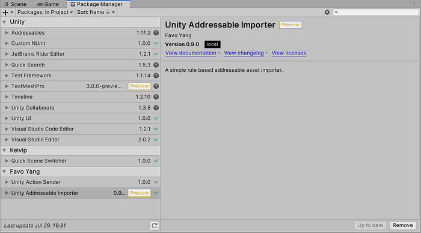
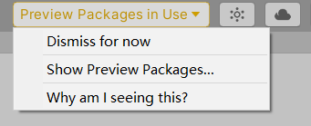
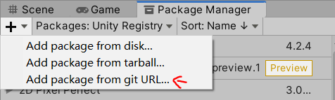
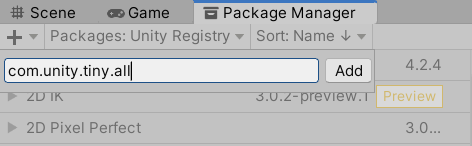
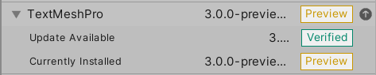
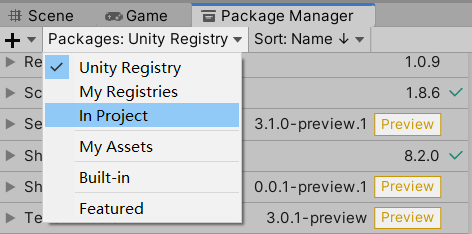
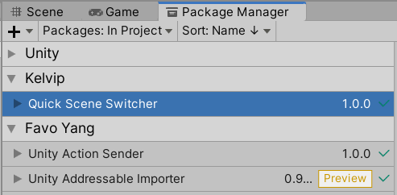
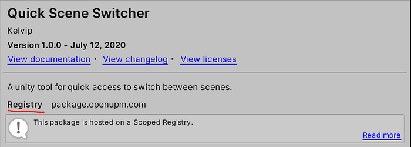

# Unity Package Manager 2020.1 Round-up

<BlogPostMeta />


Unity 2020.1 is now available to download. The update features significant changes to the Package Manager, and advertises as “a new Package Manager experience”. In the article, we’ll break down the changes below.



The new user interface of Unity Package Manager

## Preview packages in use

Besides the nice looking new UI, a significant change is probably the yellow button warns you “Preview Packages in Use”.



“Preview Packages In Use”, I warn you.

Unity developed packages can be in one of the states below:

*   In development: the package embedded in the developer’s project.
*   Preview: the package passes basic testing, and expected to be changed fast.
*   Verified: the package passes good testing and will get supported for the duration of that version of Unity.
*   Not-verified yet: the package gets updated from a verified version.

Now preview packages are no longer the first-citizen. Unity sends developers a clear message that preview packages should not be used in production without understanding the risks. By drawing a line here, Unity can fix customer expectations on unstable software, to avoid misleading their users, especially for paid users who expect to get continuous support.


Preview package vs preview version:

*   A preview package is usually a package with version less than 1.0.0. This applies to both official and custom packages. Preview packages won’t be listed in the Package Manager. To install a preview package, find the name on [this lister page](https://docs.unity3d.com/2020.1/Documentation/Manual/pack-preview.html), click the “_Add package from git URL…”_ menu button (the only option with an input field), and then type the package name and click the _Add_ button. The process is a bit confusing and high-friction.



Add a preview package step 1



Add a preview package step 2

*   A preview version is a package version using “-preview” as the [pre-release identifier](https://semver.org/): _2.3.1-preview.0_. It simply means the next in-development version of a package, like alpha or beta you’re probably more familiar with. Preview versions won’t be listed in the Package Manager unless you turn it on manually in [Advanced Project Settings](https://docs.unity3d.com/2020.1/Documentation/Manual/class-PackageManager.html).

To make it more clear, a state label is added next to the version string. But it caused a UX glitch that the version string is not fully displayed in a certain case.



The package state label

## Package source

You can now filter packages by source:

*   Unity Registry: packages from Unity official registry.
*   My Registries: packages from third-party registries (scoped registries).
*   In Project: packages installed.
*   My Assets: a shortcut view for purchased asset store products.
*   Built-in: packages (modules) shipped with Unity binary.
*   Featured: special packages featured for marketing purposes.
*   The _all_ option is removed.



Filter package by source

The “In Project” option groups custom packages by authors’ names.



Group packages by authors’ names

The author's name is loaded from the _package.json_.

```json
{
  "author": {
    "name": "Favo Yang",
    "url": "..."
  }
}
```
The package detail view also displays the package source.



Package source in detail view

## Authentication with scoped registries

Starting from Unity 2019.3.4f1, you’ll be able to [configure NPM authentication](https://forum.unity.com/threads/npm-registry-authentication.836308/) for your scoped registries. We have covered details in [How to Authenticate with a UPM Scoped Registry using CLI](/blog/how-to-authenticate-with-a-upm-scoped-registry-using-cli-afc29c13a2f8/).

## Using Git packages in a subfolder

The feature only supports the http(s) protocol.

```text
# Specify a path query
https://github.com/user/repo.git?path=/example/folder
https://github.com/user/repo.git?path=/example/folder#v1.2.3
```

## package-lock.json

The lock file concept borrowed from npm (_package-lock.json_) and yarn (_yarn.lock_). A lock file describes the exact package tree that was generated. Because at least a Git URL without specifying a version hash is not enough to identify a version, Unity used to use an inlined _lock_ field of the manifest.json to store the info. Now it is moved to a redesigned _package-lock.json_ file _._ You should commit this file to your version control system.

```json
{
  "com.littlebigfun.action-sender": {
    "version": "1.0.0",
    "depth": 0,
    "source": "registry",
    "dependencies": {},
    "url": "https://package.openupm.com"
  }
}
```
With the lock file, it is possible to implement the version operation like `^5.1.0` or `~5.1.0` in the future.

## Conclusion

This Package Manager update doesn’t ship many new features but focuses on the design changes to promote stable software and manage installed packages easily.

A few features I’m looking for the next update:

*   Split dev/production manifest files.
*   Support personal manifest file.
*   Basic UI support for authentication.


<BlogPostNav />
