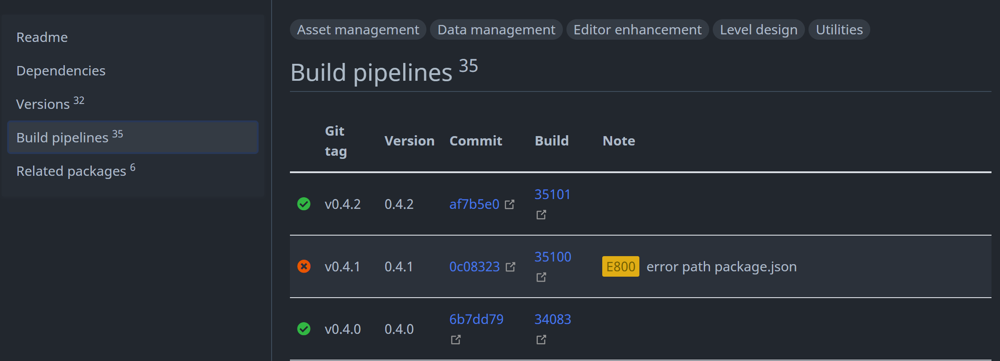

---
---

# Troubleshooting Build Errors

The build pipelines section on the package detail page reports the build status of each versioned Git tag, allowing you to check for any failed builds and their respective reasons. When a build fails, it leaves an error code and a message in the note field, providing valuable information for troubleshooting.



OpenUPM categorizes these errors into two types: retryable errors and non-retryable errors.

## Retryable Errors

**Retryable errors** are typically caused by temporary network, registry, GitHub, or build-service conditions. OpenUPM automatically retries retryable release builds up to 3 times. If a retryable error remains after all attempts, the release is retained as failed so an operator can inspect or requeue it.

For `trackingMode: githubRelease`, missing GitHub Releases and missing
publishable assets can recover after the initial attempts are exhausted.
OpenUPM checks again after 10 minutes, then 20 minutes, then 40 minutes,
doubling until the interval reaches 6 hours. It then checks every 6 hours for
up to 7 days from the first missing-release or missing-asset failure.

| Error                                          | Reason                                                                                                                                          | What to do                                                                                                                                                                                                                                                                         |
| ---------------------------------------------- | ----------------------------------------------------------------------------------------------------------------------------------------------- | ---------------------------------------------------------------------------------------------------------------------------------------------------------------------------------------------------------------------------------------------------------------------------------- |
| `E0` unknown error                             | OpenUPM could not classify the build failure.                                                                                                   | Open the linked build logs and inspect the failed step. If the logs do not point to a package-side problem, report it with the build ID.                                                                                                                                           |
| `E400` registry bad request                    | The registry rejected a publish request as invalid.                                                                                             | Check the linked build logs for the registry response. If package metadata looks valid, report it so the registry-side request can be inspected.                                                                                                                                   |
| `E401` registry unauthorized                   | The registry rejected the publish request because authentication failed.                                                                        | This is usually an OpenUPM registry credential or token issue. Report it with the build ID.                                                                                                                                                                                        |
| `E403` registry forbidden                      | The registry rejected the publish request because access was forbidden.                                                                         | This is usually an OpenUPM registry permission issue. Report it with the build ID.                                                                                                                                                                                                 |
| `E500` registry internal error                 | The registry returned an internal server error.                                                                                                 | Wait for the OpenUPM pipeline retry. If repeated builds fail with `E500`, report it with the build ID.                                                                                                                                                                             |
| `E502` upstream bad gateway                    | A temporary upstream gateway error interrupted the build or publish request.                                                                    | Wait for the OpenUPM pipeline retry after the upstream service recovers. If repeated builds fail with `E502`, report it with the build ID.                                                                                                                                         |
| `E503` upstream service unavailable            | A required upstream service was temporarily unavailable.                                                                                        | Wait for the OpenUPM pipeline retry. If repeated builds fail with `E503`, report it with the build ID.                                                                                                                                                                             |
| `E504` upstream timeout                        | A temporary upstream timeout interrupted the build or publish request.                                                                          | Wait for the OpenUPM pipeline retry after the upstream service recovers. If repeated builds fail with `E504`, report it with the build ID.                                                                                                                                         |
| `E700` build timed out                         | The Azure build did not finish before OpenUPM stopped waiting for it. The build may still finish later, and a later pipeline retry can succeed. | Wait for the OpenUPM pipeline retry or check the linked Azure build logs. If repeated builds fail with the same reason, report it with the build ID.                                                                                                                               |
| `E701` build cancelled manually                | The Azure build was cancelled.                                                                                                                  | Requeue or retag when the cancellation was accidental. If cancellation repeats, report it with the build ID.                                                                                                                                                                       |
| `E900` connection timeout                      | The build could not reach a required network service.                                                                                           | Wait for the OpenUPM pipeline retry. If repeated builds fail with `E900`, check whether the source repository, Git LFS, GitHub Release asset, or registry endpoint is reachable.                                                                                                   |
| `E904` GitHub Release not found                | For `trackingMode: githubRelease`, the configured tag did not have a matching GitHub Release.                                                   | Create the GitHub Release for the tag. OpenUPM checks again after 10 minutes, then 20 minutes, then 40 minutes, doubling to 6 hours and continuing every 6 hours for up to 7 days. After that, request a rebuild.                                                                  |
| `E905` GitHub Release asset not found          | For `trackingMode: githubRelease`, the GitHub Release exists but no publishable `.tgz` or `.tar.gz` asset matched the package metadata.         | Upload the package tarball to the GitHub Release. OpenUPM checks again after 10 minutes, then 20 minutes, then 40 minutes, doubling to 6 hours and continuing every 6 hours for up to 7 days. After that, request a rebuild.                                                       |
| `E906` multiple matching GitHub Release assets | More than one GitHub Release asset matched the package selection rules.                                                                         | Keep exactly one publishable package tarball, or set `githubReleaseAssetName` to a stable filename or prefix. Unlike `E905`, this is not expected to resolve by uploading a missing asset later; update the GitHub Release asset list or package metadata, then request a rebuild. |
| `E907` GitHub Release API error                | GitHub's API failed while OpenUPM was looking up the release or asset.                                                                          | Wait for the OpenUPM pipeline retry. If repeated builds fail with `E907`, report it with the build ID.                                                                                                                                                                             |
| `E908` GitHub Release asset download failed    | The selected GitHub Release asset could not be downloaded in the Azure build.                                                                   | Check that the asset is still attached, public, and downloadable. Replace the asset or request a rebuild after GitHub recovers.                                                                                                                                                    |

## Non-retryable Errors

**Non-retryable errors** are usually caused by package metadata, source repository, versioning, or repository-size issues. A rebuild will usually fail the same way until the package owner changes the source repository, package metadata, or release tag.

| Error                                                      | Reason                                                                                                                                            | What to do                                                                                                                                                                                                                           |
| ---------------------------------------------------------- | ------------------------------------------------------------------------------------------------------------------------------------------------- | ------------------------------------------------------------------------------------------------------------------------------------------------------------------------------------------------------------------------------------ |
| `E409` version already exists                              | The package version has already been published. This often happens when a new Git tag points to a package.json version that was already released. | Update the `version` field in package.json, commit it, and create a new tag. Do not reuse an already published package version.                                                                                                      |
| `E413` package is larger than 512MB                        | The packed package is larger than the registry limit.                                                                                             | Remove generated files, caches, large binaries, or other unnecessary content from the package. Use `.npmignore` or the `files` field in package.json to control what gets packed.                                                    |
| `E800` error path package.json                             | The build could not find a package.json with the expected package name.                                                                           | Make sure the tagged commit contains package.json, the package name matches the OpenUPM metadata, and the package is under the expected path. If package.json was added after the tag, create or move the tag to the correct commit. |
| `E801` package is explicitly private                       | package.json has `"private": true`.                                                                                                               | Remove `"private": true` for public packages, commit the change, and create a new tag.                                                                                                                                               |
| `E803` package name is invalid                             | The package name is not valid for OpenUPM.                                                                                                        | Use a reverse-DNS Unity package name such as `com.company.package`. Scoped npm names such as `@scope/name` are not supported as UPM package names.                                                                                   |
| `E804` invalid package.json format                         | package.json could not be parsed or is missing required fields.                                                                                   | Validate package.json, make sure it is valid JSON, and include required fields such as `name` and `version`.                                                                                                                         |
| `E805` remote branch or tag not found                      | The configured Git tag or branch was not found in the source repository.                                                                          | Confirm the tag exists on the remote repository and matches the OpenUPM release metadata. Push the missing tag or create a new valid tag.                                                                                            |
| `E806` invalid package version                             | The package.json `version` field is not a valid version string for publishing.                                                                    | Update package.json to a valid semantic version, commit it, and create a new tag.                                                                                                                                                    |
| `E807` remote repository unavailable                       | The source repository could not be reached. It may be deleted, renamed, unavailable, or private.                                                  | Make sure the repository URL is correct and public. Update OpenUPM metadata if the repository moved.                                                                                                                                 |
| `E808` remote submodule repository unavailable             | A Git submodule repository could not be reached.                                                                                                  | Make each required submodule public and reachable, or remove the submodule from the package source.                                                                                                                                  |
| `E809` submodule commit cannot be fetched                  | A referenced submodule commit is missing or inaccessible.                                                                                         | Push the missing submodule commit to its remote, update the submodule pointer, and create a new tag.                                                                                                                                 |
| `E810` npm publish lifecycle hook failed                   | An npm lifecycle hook such as `prepack`, `prepare`, or `postpack` failed during package packing or publishing.                                    | Fix or remove the failing lifecycle script. OpenUPM packages should not depend on unpublished local build tooling during publish.                                                                                                    |
| `E811` package.json version does not match release version | The package.json version in the selected source does not match the version OpenUPM discovered from the Git tag or GitHub Release.                 | Move or recreate the Git tag or GitHub Release so it matches the package.json version. For example, package.json version `1.0.0` should use a matching release tag such as `v1.0.0` or `1.0.0`.                                      |
| `E901` heap out of memory                                  | The package build ran out of memory. Large package contents are a common cause.                                                                   | Reduce package size, remove generated/cache files from the packed package, or split very large assets into a different delivery path.                                                                                                |
| `E902` Git LFS budget exceeded                             | Git LFS refused the download because the repository exceeded its bandwidth quota.                                                                 | Restore Git LFS bandwidth or remove required LFS objects from the package source, then request a rebuild.                                                                                                                            |
| `E903` Git LFS object is missing                           | A Git LFS pointer exists, but the referenced object is missing from the remote server.                                                            | Upload the missing LFS object or remove the broken pointer, then create a new tag.                                                                                                                                                   |

## How to Trigger a Rebuild for a Failed Build

So you've encountered a failed build and successfully fixed the issue. How do you trigger a rebuild? The solution is to re-tag the existing Git tag.

When the build pipelines detect a failed Git tag that has been re-tagged, it will initiate a rebuild. It's important to note that the build pipelines will not rebuild an already successful release, even if they detect that the Git tag has been removed or re-tagged. This is because what has been released on the registry is immutable.

To re-tag an existing Git tag, you can follow these steps:

1. Locate the Git tag on the GitHub website.
2. Delete the existing tag.
3. Create a new tag with the same name from the latest commit.

Alternatively, you can use the following commands to re-tag a Git tag:

```bash
# List all remote tags
git ls-remote --tags

# Delete the local tag
git tag -d v1.0.1

# Push the tag deletion to the remote
git push origin :refs/tags/v1.0.1

# Tag the local branch again
git tag v1.0.1

# Push the tag to the remote
git push origin tag v1.0.1
```

Some repositories adhere to an immutable policy that disallows re-tagging. In such cases, you can trigger a new build by incrementing the package version. For instance, if the erroneous Git tag is `v1.0.1`, you should update the package version to `1.0.2` and then create a new Git tag, `v1.0.2`, to initiate a new build.
